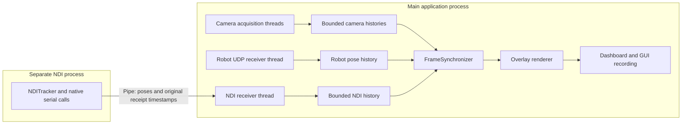

# Live ultrasound overlay: work session summary

Date: October 5, 2026. Application: `scripts/live_ultrasound_overlay.py`.

This session added full-dashboard video recording, corrected accelerated video
playback, investigated unmatched tracking poses, and removed severe processing
stalls. The largest cause was interference from the NDI driver's blocking calls
inside the application's Python interpreter. Moving NDI acquisition into a
separate process, reducing image-processing work, and improving clock resolution
restored responsive operation. A subsequent recorded run processed approximately
29.6 frames per second with a median frame age of 70.8 ms.

The work proceeded through these issues and resolutions:

1. **The existing video option recorded only the overlay.** The user wanted a
   recording of the GUI for later review. We added `--gui-output`, which saves the
   complete 1440×960 dashboard, including the overlay, camera previews, telemetry,
   and waiting/stale indicators. It captures the application canvas rather than
   the desktop or window borders. Recording finalizes when the application exits.
   The existing `--output` option continues to save the overlay image alone.

2. **The initial dashboard recording played too quickly.** It wrote one frame
   per GUI update into an MP4 declared as 30 fps. If the GUI updated only ten times
   in one second, playback showed those ten frames in one-third of a second.
   `RealtimeVideoWriter` now uses elapsed host time to determine how many output
   frames each displayed image occupies. It repeats the previous image between
   updates and includes the final interval before shutdown. This preserves the
   speed of the displayed session within one video-frame interval. It preserves
   display timing, not the devices' physical capture timing. The overlay-only
   `--output` recording retains its original fixed-frame-rate behavior.

3. **Some robot poses were unmatched.** At the initial CSV inspection, 19 logged
   frames contained 15 rendered overlays, three `robot_unmatched` entries, and
   one `ultrasound_unmatched` entry. No NDI unmatched entries appeared in that
   particular log. For ECM frames 334, 417, and 694, the nearest robot timestamp
   differed by +31, −31, and −31 ms respectively, exceeding the configured ±20 ms
   robot tolerance. The NDI tolerance was ±40 ms; its recorded differences were
   within ±16 ms. Blank pose sequence/time fields meant that a candidate was
   rejected by matching, rather than proving that no packets were arriving.
   That CSV alone could not distinguish arrival jitter from scheduling delays.

4. **The GUI and rendering had severe lag.** The initial log contained only 19
   selected frames across roughly 59 seconds, despite continuing camera and pose
   acquisition. Its mean frame age was approximately 550 ms, and rendered frames
   were 484–781 ms old when logged. Controlled live profiling compared the same
   image-processing workload with NDI acquisition off and on. Enabling the
   original NDI thread inflated overlay computation from about 122 to 434 ms,
   and dashboard composition from about 22 to 507 ms. A diagnostic thread that
   slept for 1 ms took approximately 17 ms to resume typically, and up to 100 ms.
   NDI serial commands took approximately 17 ms each and were issued repeatedly.
   This strongly indicates that the native driver retained Python's global
   interpreter lock while waiting for replies. Serial communication itself is
   not inherently the problem; the driver's behavior prevented other threads in
   the same interpreter from progressing promptly. The compiled binding's source
   was not inspected, so lock retention is an inference supported by the timing
   experiments rather than a source-level finding.

5. **Image processing added unnecessary work.** The overlay originally warped
   the scan and mask across the full 1920×1080 frame, then allocated several
   full-frame floating-point arrays for blending. It now restricts warping and
   blending to the projected slice's visible bounds, including the source-pixel
   support needed to preserve antialiased edges. OpenCV's `blendLinear` replaces
   the large NumPy blending expressions. Dashboard previews use linear resizing,
   and OpenCV fills the background canvas. Capture resolution, calibration
   geometry, and image aspect ratios remain unchanged. Tests compare the new
   result with the former full-frame calculation, including clipped slices;
   differences of at most one intensity level are allowed because OpenCV rounds
   where the former NumPy conversion truncated.

6. **The Windows clock was too coarse for matching and GUI scheduling.** In the
   Python 3.11 hardware environment, `time.monotonic_ns()` used `GetTickCount64`
   with 15.625 ms resolution. Nanosecond units did not provide nanosecond
   resolution. A nominal 33 ms GUI interval consequently often needed another
   clock tick, limiting refresh to approximately 21 fps. All acquisition receipt
   times, matching, frame ages, GUI scheduling, and recording now use
   `LiveData.clock.clock_ns()`, backed by `time.perf_counter_ns()` and Windows
   `QueryPerformanceCounter`. The measured clock resolution was 100 ns. The NDI
   process uses the same host clock, so its original timestamps remain comparable
   to camera and robot timestamps. The two clock epochs must not be mixed.

7. **Freshness checks could miss time spent rendering.** The application now
   checks frame age again after rendering, uses the ECM frame's timestamp for
   overlay freshness, and obtains a fresh clock reading before updating the GUI.
   A frame that becomes stale during processing is suppressed rather than kept
   visible because it was fresh at the beginning of the loop.

The new architecture preserves the existing synchronizer and bounded histories.
Only NDI hardware access moved into another process. Camera acquisition and robot
UDP reception remain background threads in the main application process.



The NDI process owns the tracker and serial connection. It sends readiness,
samples, and acquisition errors through a pipe. The receiver thread reconstructs
immutable pose samples and appends them to the existing history. Duplicate device
frames are ignored; invalid measurements remain invalid. Matching tolerances
were not increased, and previous valid poses are not substituted for invalid
ones. Rendering, GUI updates, and video encoding still run on the main thread.

On shutdown, the parent requests that the device process stop and release the
tracker. If the native driver blocks, the parent terminates that process after
three seconds and reports the shutdown error. Startup failures and unexpected
child exits are also propagated to the application.

Live component benchmarks with both cameras, robot reception, and NDI acquisition
active produced these median timings. Each component comparison used eight
iterations with a controlled projected-slice workload; these are diagnostic
measurements on this machine rather than performance guarantees.

| Operation | Before | After |
|---|---:|---:|
| Synchronizer polling | 12.2 ms | 0.6 ms |
| Slice warping and blending | 434.0 ms | 7.4 ms |
| Dashboard composition | 506.5 ms | 4.2 ms |
| Encoding one dashboard frame | 24.7 ms | 6.2 ms |
| Diagnostic 1 ms sleep, observed duration | 17.0 ms | 2.0 ms |

A separate five-second test with the real NDI tracker, controlled image inputs,
and recording sustained approximately 30 GUI updates per second. Its MP4 playback
duration was exactly five seconds. A deliberately slow GUI test also confirmed
the recording correction: 1.962 seconds elapsed produced 1.967 seconds of video.

The final supervised 15-second test used both live cameras, robot reception, NDI
acquisition, and GUI recording. It produced 417 GUI updates (27.8 fps), 448 logged
camera frames (approximately 30 fps), a median frame age of 73.8 ms, and a maximum
age of 99.8 ms. Its MP4 playback duration was 15 seconds. During this test the
physical probe reported invalid tracking quality, so a separate rendering
workload exercised the optimized slice computation without displaying or
logging it as valid tracking. Startup tracking validation was bypassed only in
the temporary diagnostic script; normal application startup still requires valid
robot and NDI input.

At document creation, the user's timing CSV contained a subsequent run spanning
53.5 seconds of ECM timestamps. It provided further evidence from actual rendered
overlays:

| Subsequent recorded run | Result |
|---|---:|
| Logged frames | 1,587 |
| Processing rate | 29.64 fps |
| Successfully rendered overlays | 1,251 |
| Frames with invalid NDI tracking | 334 |
| Robot unmatched only | 1 |
| Robot and NDI unmatched together | 1 |
| Mean / median frame age | 69.9 / 70.8 ms |
| Maximum frame age | 92.2 ms |

Invalid NDI measurements are a remaining tracking condition, distinct from the
processing lag. The CSV does not identify the physical cause of those invalid
measurements. Successful rendering also does not independently verify physical
calibration alignment or camera capture-time synchronization.

Eighteen relevant regression tests passed, covering recording duration, matching,
rendering, duplicate NDI frames, process timestamp transfer, immutable poses,
startup errors, and termination of a blocked driver. Four pre-existing robot
lifecycle tests still failed in the full suite: receiver readiness, startup
failure handling, receive failure handling, and UDP registration retry timing.
Those failures were present before these changes and were not resolved in this
session.

The implementation and documentation changes are located in these files:

| File | Responsibility |
|---|---|
| `scripts/live_ultrasound_overlay.py` | Recording option, orchestration, clock use, and freshness checks |
| `src/LiveData/overlay_gui.py` | Dashboard composition and real-time recording timeline |
| `src/LiveData/receivers.py` | NDI device process, IPC bridge, cleanup, and camera timestamp use |
| `src/LiveData/clock.py` | Shared high-resolution monotonic clock |
| `src/LiveData/robot_receiver_class.py` | Robot receipt timestamps use the shared clock |
| `src/LiveData/synchronizer.py` | Matching uses the shared clock |
| `scripts/reproject_ultrasound.py` | Cropped perspective warping and OpenCV blending |
| `tests/test_live_overlay.py` | Recording and existing regression checks |
| `tests/test_live_performance.py` | Process lifecycle and rendering-equivalence checks |
| `scripts/LIVE_OVERLAY.md` | Usage, architecture, and timestamp documentation |

From the repository root, the existing recording command remains:

```powershell
python scripts/live_ultrasound_overlay.py --config scripts/live_overlay_config.json --gui-output src\data\20260815_test\gui_1005.mp4
```

GUI mode is required. Output paths are overwritten, so use a new filename when
retaining earlier sessions. Close the GUI normally to finalize the recording.

Diagnostic evidence is preserved in
[`live_overlay_2026-10-05/`](live_overlay_2026-10-05/):

- [`before_live_profile.json`](live_overlay_2026-10-05/before_live_profile.json)
  and [`after_live_profile.json`](live_overlay_2026-10-05/after_live_profile.json):
  live component comparisons with NDI off and on.
- [`ndi_isolation_profile.json`](live_overlay_2026-10-05/ndi_isolation_profile.json):
  five-second display and recording tests using the isolated NDI process.
- [`full_gui_profile.json`](live_overlay_2026-10-05/full_gui_profile.json):
  the final supervised 15-second diagnostic run.
- [`subsequent_run_summary.json`](live_overlay_2026-10-05/subsequent_run_summary.json)
  and [`subsequent_run_timing.csv`](live_overlay_2026-10-05/subsequent_run_timing.csv):
  a snapshot of the later run inspected when this document was written.

The original timing log was not overwritten by the diagnostic runs. They used
temporary CSV and MP4 paths; the later evidence snapshot leaves the user's
current recording and timing files unchanged.

**Detailed implementation of the solution**

The changes address different parts of the delay. Process isolation lets the GUI
make progress while the tracker waits for data. Rendering optimization reduces
the amount of computation per update. The clock change improves scheduling and
timestamp precision. The recording timeline preserves the duration of what was
displayed. These responsibilities remain separate so that a correct video
duration does not conceal a slow live display.

**Why a background thread was insufficient.** In the original design,
`NDIReceiver.acquire()` called `NDITracker.get_frame()` in a worker thread. The
tracker library issues a native `ndicapy.ndiCommand()` to obtain a response from
the device, then decodes the tool's frame number, transform, and quality. In
CPython, threads in one interpreter share the global interpreter lock (GIL).
Blocking native functions can release that lock, allowing other Python threads
to run while the device responds. The measured behavior here strongly suggests
that the installed binding did not release it during its command waits.

A thread can therefore be waiting for the serial device while still preventing
the GUI thread from executing Python code. Moving rendering to another thread in
that same process would retain the shared lock. Adding sleeps to NDI polling
could create execution opportunities, but would trade tracking throughput for
responsiveness and would still expose the GUI to each blocking driver call.
The implemented fix puts the driver in a separate interpreter instead.

**How the NDI process starts and transfers measurements.**
`NDIReceiver` still exposes the `Worker` interface used by the entry script. Its
receiver thread now creates a multiprocessing context with the `spawn` method,
a one-way pipe, a shared stop event, and a child named `ndi-device`. `spawn`
starts a fresh interpreter, which is appropriate for Windows and avoids
inheriting the parent application's active threads and device handles. The
existing entry point's `if __name__ == "__main__"` guard prevents a spawned
interpreter from launching another overlay application.

The child imports and constructs `NDITracker`, selects matrix output, and starts
tracking. It sends a readiness message only after that initialization succeeds.
It owns the tracker and serial connection for the rest of its lifetime. The
parent owns its end of the pipe and the local pose history; it never calls the
NDI hardware API in production.

The protocol consists of three message types:

| Message | Contents | Parent behavior |
|---|---|---|
| `ready` | No payload | Releases the receiver's startup readiness wait |
| `sample` | Sequence, matching timestamp, receipt timestamp, transform, validity, reason, device frame number, quality | Reconstructs a `TransformSample` and appends it to the NDI history |
| `error` | Exception type and message | Records an acquisition failure through the worker lifecycle |

For each device result, the child performs these operations:

1. Calls `get_frame()` and records `clock_ns()` immediately after it returns.
2. Reads the configured tool's device frame number and quality. An unchanged
   device frame number is skipped so that repeated reads do not become new
   measurements.
3. Converts the transform's translation from millimetres to metres and validates
   the quality and rigid transform. Invalid results produce a sample with
   `valid=False`, a reason, and no transform.
4. Preserves the host receipt time and applies only the configured latency
   correction to the matching timestamp.
5. Sends the sample fields through the pipe.

Only pose data crosses the process boundary. A valid 4×4 float64 transform
contains 128 bytes of numeric data, plus the sample metadata and serialization
overhead. The much larger ECM and ultrasound images stay in the main process's
camera histories. This avoids sending full video frames between interpreters.

The receiver thread uses `incoming.poll(0.05)`. The 50 ms value is a maximum wait
when no message is available, not an intentional delay applied to each pose. A
message wakes the receiver as soon as the pipe becomes readable. This thread can
collect poses while the main thread renders or encodes a frame. Its history
retains at most 300 samples by default. The pipe has finite OS buffering rather
than an unbounded application queue; if the receiver stops draining it, the
child can eventually block on sending instead of accumulating unlimited data.

Constructing `TransformSample` again in the parent matters because process
serialization creates new arrays. The constructor validates the sample and
rebuilds immutable array storage, preserving the application's existing
assumption that consumers cannot alter measurements in a history. An injected
fake tracker can still run in the worker thread for unit tests. Real hardware
uses the process path by default, and separate tests exercise that path.

**How timing remains comparable across processes.** The pipe transfer does not
assign a new acquisition timestamp. If a pose is received by the child at time
`t` and delivered to the parent later, its receipt time remains `t`:

```text
received_ns  = child clock immediately after get_frame()
monotonic_ns = received_ns - configured_latency_ns
```

The field retains its existing name, `monotonic_ns`, even though its source is
now `perf_counter_ns()`. All timestamps used for matching come from the same
high-resolution host clock. The Windows performance counter is shared across
processes, so a timestamp obtained by the child can be compared with a timestamp
obtained by a camera or robot receiver in the parent. The process-transfer test
checks that the original timestamp and configured offset survive transport.

For example, an ECM receipt timestamp of 1.000 seconds and an NDI receipt
timestamp of 1.018 seconds have a +18 ms difference. Delivery of that pose to
the parent at 1.024 seconds does not change the recorded difference to +24 ms.
The parent must receive the pose before the synchronizer finalizes that ECM
frame for it to be considered, so IPC delay can still affect availability. It
does not silently change the measurement's timestamp.

`FrameSynchronizer` continues to use ECM as its anchor. It waits until all source
histories cover their future tolerance windows, or until the 60 ms receipt-time
deadline. It then selects each stream's nearest timestamp. The limits remain
±20 ms for ultrasound, ±20 ms for robot, and ±40 ms for NDI. A pose outside its
limit becomes `*_unmatched`; an invalid pose inside the limit becomes
`*_invalid`. More precise timestamps improve this comparison, but neither
process isolation nor the new clock establishes hardware capture-time
synchronization.

The clock change also addresses GUI scheduling directly. A 33 ms refresh
threshold was awkward for the former clock: two 15.625 ms ticks are only
31.25 ms, so the threshold often required a third tick, or 46.875 ms. That
corresponds to about 21 updates per second. The performance counter permits the
threshold to be evaluated at much finer intervals. Processing work can still
limit refresh, which is why the final full application test measured 27.8 fps
instead of claiming a guaranteed 30 fps.

**How the optimized overlay preserves geometry.** The renderer still projects
the calibrated ultrasound corners through the same transforms and camera
intrinsics. `overlay_slice()` still creates a homography `H` from scan pixels
to ECM pixels. The optimization changes the area processed after this
projection.

A 1920×1080 frame contains 2,073,600 pixels. A representative 600×500 slice
bounding box contains 300,000 pixels, about 14.5% of that area. The former
implementation processed the full frame regardless of slice size. Its float32
copy of a full BGR image alone occupied approximately 24.9 MB, and the blend
expression created multiple such temporaries. The new implementation keeps one
full output image copy, but performs the expensive warping, mask construction,
and blending inside the clipped slice bounds.

For a bounding box beginning at ECM pixel `(left, top)`, the homography used
for the smaller output is:

```text
T = [[1, 0, -left],
     [0, 1, -top ],
     [0, 0, 1    ]]

H_local = T @ H
```

This translates the projected ECM coordinates into coordinates within the
smaller output image. It does not resize the camera image, change the scan's
physical scale, or alter the calibration transform. The completed region is
written back into `result[top:bottom, left:right]`.

The bounding calculation includes one source pixel beyond each scan edge before
projection, plus a small destination margin. Bilinear interpolation can draw
partially covered pixels outside the quadrilateral defined by the source's
corner centres; omitting that support would cut off visible edge pixels when
the scan is enlarged or clipped. An early equivalence test found this edge
case, and the bounds calculation was corrected. If the expanded support has
invalid or sign-changing projective denominators, the function falls back to
full-frame bounds. A region completely outside the camera image returns the
background copy.

Inside the selected region, the warped mask determines opacity:

```text
alpha = clip((warped_mask / 255) * opacity, 0, 1)
output = blendLinear(warped_scan, ECM_region, alpha, 1 - alpha)
```

OpenCV performs the blend on uint8 image inputs, avoiding the former repeated
conversion of entire BGR frames to float arrays. The tests verify visible,
partially offscreen, and fully offscreen slices against the original algorithm
and require background pixels outside the mask to remain unchanged.

**How dashboard recording holds the original playback speed.**
`OverlayGUI.update()` composes one canvas, passes that same canvas to `imshow`,
and submits it to `RealtimeVideoWriter`. The wrapper stores a private copy of
the last displayed image and counts encoded frames. Its timeline starts on the
first submitted image. At a subsequent update, it calculates:

```text
target_frame_count = ceil((now_ns - started_ns) * 30 / 1_000_000_000)
```

It writes copies of the previous image until that count is reached, then stores
the newly displayed image for the next interval. For example, updates at 0,
100, and 350 ms, followed by shutdown at 500 ms, generate 15 frames: three copies
of the first image, eight of the second, and four of the third. The result lasts
0.5 seconds at 30 fps, rather than shrinking to 0.1 seconds because only three
GUI updates occurred.

The wrapper does not interpolate motion or create missing live updates. It
records the previous display held during each interval. `release()` fills the
final interval and releases the underlying encoder even if writing raises an
exception. The existing `ExitStack` calls cleanup on normal exit, Ctrl+C, or an
acquisition failure. Encoding remains synchronous on the main thread; its
measured cost after the fix was approximately 6 ms per dashboard frame. Moving
encoding to another worker was unnecessary to remove the measured severe lag.

**How frame freshness and cleanup constrain the result.** The synchronizer's
250 ms age budget is evaluated when polling. The entry script now evaluates it
again after rendering so that processing cannot turn a fresh bundle into a
stale overlay that remains labelled rendered. It also stores the original ECM
timestamp as `last_display_ns` and refreshes the clock before GUI composition.
When video stops, continued GUI updates therefore show the waiting/stale state
instead of extending the apparent life of the last overlay.

The NDI stop event is separate from the parent worker's thread stop event. The
parent thread detects its stop request, signals the child, and waits up to three
seconds for normal device cleanup. A blocked child is terminated, followed by a
bounded join. The receiver clears its process reference and closes the pipe.
`NDIReceiver.stop()` surfaces the termination error rather than reporting a
successful normal shutdown. Tests exercise both a child startup error and a
child that deliberately ignores the stop request.

The measured remaining frame age is expected to include the bounded matching
wait and image-processing time. The final median of roughly 70–74 ms is consistent
with that pipeline and is substantially different from the former repeated
interpreter stalls. Physical tracking loss can still suppress an overlay, and a
slower machine or larger slice can still increase computation time. The solution
removes the measured driver-induced stalls and unnecessary full-frame work
while preserving visibility of those conditions.
